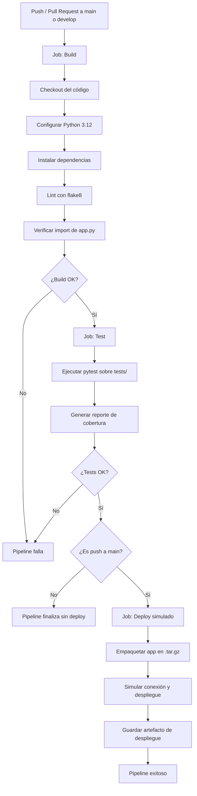

# Caso de estudio: Pipeline CI/CD con GitHub Actions

Proyecto de ejemplo: una **calculadora de divisiones seguras** (`dividir`), usada
para demostrar un flujo completo de **Build → Test → Deploy**.

## 1. Estructura del proyecto

```
proyecto-cicd/
├── app.py                      # Lógica de la aplicación (función dividir)
├── requirements.txt            # Dependencias
├── pytest.ini                  # Configuración de pytest
├── tests/
│   └── test_app.py             # Pruebas unitarias (10 casos)
└── .github/
    └── workflows/
        └── ci-cd.yml           # Definición del pipeline
```

## 2. Diagrama del flujo



## 3. Explicación de cada etapa

| Etapa | Qué hace | Herramienta |
|---|---|---|
| **Build** | Descarga el código, instala dependencias, ejecuta `flake8` (análisis estático) y verifica que `app.py` se pueda importar sin errores | `actions/checkout`, `actions/setup-python`, `flake8` |
| **Test** | Ejecuta las 10 pruebas unitarias con `pytest`, incluyendo casos normales, división por cero, tipos inválidos y casos parametrizados; genera reporte de cobertura | `pytest`, `pytest-cov` |
| **Deploy** | Empaqueta la app en un `.tar.gz` identificado con el hash del commit y simula el despliegue (conexión, subida, reinicio de servicio) | `actions/upload-artifact` |

## 4. Justificación técnica

- **Jobs separados con `needs`**: `build`, `test` y `deploy` son jobs independientes encadenados con `needs`. Esto asegura que si el build falla, ni las pruebas ni el despliegue se ejecutan, ahorrando minutos de CI y dando retroalimentación rápida (principio de "fail fast").

- **Lint antes de test**: separar el análisis estático (flake8) del build permite detectar errores de estilo/sintaxis antes de invertir tiempo en pruebas más costosas.

- **Condición `if` en deploy**: el job de despliegue solo se ejecuta cuando el evento es un `push` a `main` (`github.ref == 'refs/heads/main'`). Esto evita que un *pull request* o una rama de desarrollo dispare un despliegue accidental a producción.

- **`environment: production`**: permite configurar en GitHub *protection rules* (por ejemplo, aprobación manual de un revisor) antes de que el job de deploy se ejecute, algo esencial en un entorno real.

- **Despliegue simulado con artefacto versionado**: en lugar de desplegar a un servidor real, el pipeline empaqueta la app con el SHA del commit como identificador. Esto es una práctica común para validar el flujo completo sin necesitar infraestructura real, y es trivialmente reemplazable por un paso real (por ejemplo `scp`, `docker push`, o un webhook a un servicio como Render/Railway).

- **Cobertura de pruebas como artefacto**: subir el reporte de cobertura (`coverage.xml`) permite integrarlo después con herramientas como Codecov o SonarQube sin cambiar el pipeline.

- **`app.py` con manejo explícito de errores**: se usa una excepción personalizada (`DivisionPorCeroError`) en lugar de dejar que Python lance `ZeroDivisionError` directamente, lo que hace las pruebas más claras y el comportamiento de la app más predecible — buena práctica que el pipeline valida automáticamente.

## 5. Pasos para implementarlo en GitHub

1. Crea un repositorio nuevo en GitHub (o usa uno existente).
2. Copia dentro los archivos: `app.py`, `requirements.txt`, `pytest.ini`, `tests/test_app.py` y `.github/workflows/ci-cd.yml`, respetando las carpetas.
3. Haz commit y push:
   ```bash
   git init
   git add .
   git commit -m "Configura pipeline CI/CD con build, test y deploy"
   git branch -M main
   git remote add origin https://github.com/TU_USUARIO/TU_REPO.git
   git push -u origin main
   ```
4. Ve a la pestaña **Actions** de tu repositorio en GitHub: el workflow `CI/CD Pipeline - Calculadora` se ejecutará automáticamente.
5. (Opcional) Configura el *environment* `production` en **Settings → Environments** para añadir un revisor obligatorio antes del deploy.
6. Cada push a `main` disparará build → test → deploy; cada *pull request* solo ejecutará build → test (sin deploy), lo que sirve como control de calidad antes de fusionar.

## 6. Ejecución local (antes de subir a GitHub)

```bash
pip install -r requirements.txt
flake8 app.py --max-line-length=100
pytest tests/ -v --cov=app --cov-report=term-missing
python app.py
```
